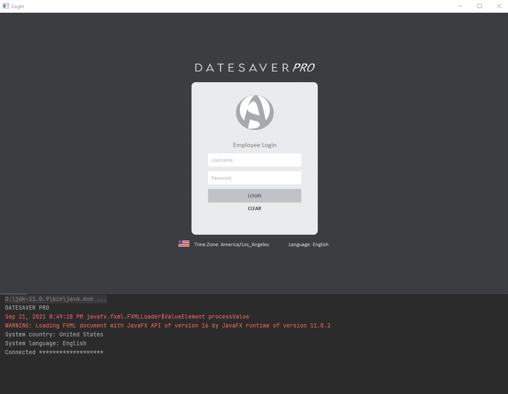

# DateSaver
A desktop scheduling program used to maintain a MySQL database of customers and appointments with functions that allow each to be added, updated, or deleted.

 

  <kbd>
</img>
  </kbd>

 
Author: Alyssa Weiglein 
Contact: aweigle@wgu.edu 
Version: 2.0 
Date: 09/20/2021 

### Setting up the program:
IDE: IntelliJ Community 2020.03 
JDK: Java SE 11.0.9 
JavaFX: JavaFX-SDK-11.0.2 
MySQL Driver: mysql-connector-java-8.0.23 

### Running the program:
1. The program starts at a login screen where the user enters a username and password. 
   * Username: `test`  
   * Password: `test`  
        
2. Upon successful login, user will arrive at the appointment scheduling screen, where appointments can be created, modified, or deleted.
    <ins>APPOINTMENT SCREEN</ins>
   * Appointments can be filtered by 'All', 'Week', or 'Month', and will display a date label that corresponds to the selected radio button. 
   * Errors show in the bottom left corner.
   * Upcoming appointments show in the bottom middle label.
   * Current date, time, and a logout button is in the bottom right corner.
   * Reports can be viewed with the buttons in the top right corner.
      
3. Upon clicking the customer button, user will arrive at the customer database screen, where customers can be created, modified, or deleted.
    <ins>CUSTOMER SCREEN</ins>
   * Errors show in the bottom left corner.
   * Upcoming appointments show in the bottom middle label.
   * Current date, time, and a logout button is in the bottom right corner.
   * Reports can be viewed with the buttons in the top right corner.

### Reporting:
1. Requirement: Appointment count grouped by <b>type & month</b>.
2. Requirement: Appointments grouped by <b>contact</b> (with appointment ID, title, type, description, start date/time, end date/time, customer ID).
3. My third report choice: A display of the appointment types as a pie chart.
4. Additional report: Total successful and failed login attempts. 

### Lambda expressions:
1. Found at [Util.DBConnection] Line: 75
   * Lambda expression checks if the program is running.
   * Boolean 'checkUserData' checks that the username and password are in the database and authorizes the connection if true.
2. Found at [ViewController.AppointmentScreenController] Line: 118 & at [ViewController.CustomerScreenController] Line: 118
   * Lambda expression continually updates current time and date label.
